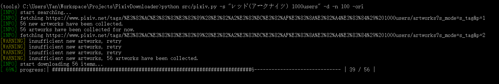
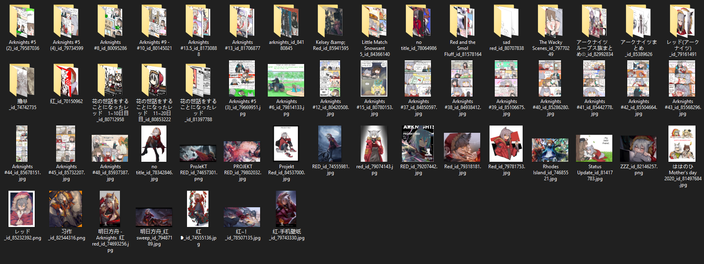

# PixivDownloader
This is a scrap project to search and download artworks from pixiv.net

## Install

- [Set up python3](https://www.python.org/downloads/).

- Clone project.

- Open terminal under root folder of the project.

- Install dependencies:

```bash
pip install -r src/requirements.txt
```

- Download a [web driver](https://sites.google.com/a/chromium.org/chromedriver/downloads) according to your chrome version ([how can I get the version of my chrome browser?](https://www.businessinsider.com/what-version-of-google-chrome-do-i-have?r=DE&IR=T)) and save the it under ```src/driver/```.
- Log in [pixiv](www.pixiv.net) using your chrome browser with your own account for once.

## Usage

Open terminal under root folder of the project:

**Search and download**

```bash
python pixiv.py [-s SEARCH] [-n NUMBER] [-o OUT] [-sm SEARCH_MODE] [--m MODE] [-d] [-ori]
```

*necessary*

- -s: what you want to search for.
- -n: number of results you want to get, ```0``` for all artworks.

*optional*

- -o: the folder to save artworks; default by a dictionary named by the term you searched for under root folder of project. 
- -sm: search mode; ```perfect``` for perfect matching; default by partial matching; ```title``` for title matching;.
- -m: age limitation; ```safe``` for ALL AGE; ```r18``` for R18 ONLY; default by no limit.
- -d: flag, set to directly download searched results without asking for confirmation.
- -ori: flag, set to download original picture(.png), otherwise download compressed picture(.jpg).

**Download via id**

```bash
python pixiv.py [-id ILLUSID] [-o OUT] [-p] [-ori]
```

*necessary*

- -id: the id of the artwork you want to download.

*optional*

- -o: the folder to save artworks; default by root folder of project.
- -p; the number of painting contained by the target artwork with identical id; default by 1.
- -ori: flag, set to download original picture(.png); default by downloading compressed picture(.jpg).

**Download via author's id**

```bash
python pixiv.py [-aut AUTHOR_ID] [-n NUMBER] [-o OUT] [-ori]
```

*necessary*

- -id: id of the author.
- -n: number of results you want to get, ```0``` for all artworks.

*optional*

- -o: the folder to save artworks; default by root folder of project.
- -ori: flag, set to download original picture(.png); default by downloading compressed picture(.jpg).

## Examples

**Search and download**

Search for 100 artworks related to "stein gate 1000users入り" in png format.

```bash
python pixiv.py -s "stein gate 1000users入り" -n 100 -ori
```

Search for 100 artworks related to "stein gate 1000users入り" and download them without asking for confirmation.

```bash
python pixiv.py -s "stein gate 1000users入り" -n 100 -d
```

Search for 100 artworks perfectly matched with "stein gate 1000users入り"  for all ages and save it under ```./artworks```.

```bash
python pixiv.py -s "stein gate 1000users入り" -n 100 -o "./artworks" --sm perfect -m safe
```

**Download via id**

Download the artworks with id: 78396392 under ```./art```

```bash
python pixiv.py -id 78396392 -o art
```

Download the artworks with id: 82733226 under ```./art``` which contains 26 paintings.

```bash
python pixiv.py -id 82733226 -o art -p 26
```

**Download via author's id**

Download all artworks of the author with id 5806400.

```bash
python pixiv.py -aut 5806400 -n 0
```

## Demo





## Note

- Must have chrome installed on your device.
- Privacy concern: this tool utilize cookies of [pixiv.net](www.pixiv.net) from your chrome browser only to load [dynamic pages](https://www.doteasy.com/web-hosting-articles/what-is-a-dynamic-web-page.cfm).
- If you are using VPN or other forms of proxy, make sure to be under global mode.

